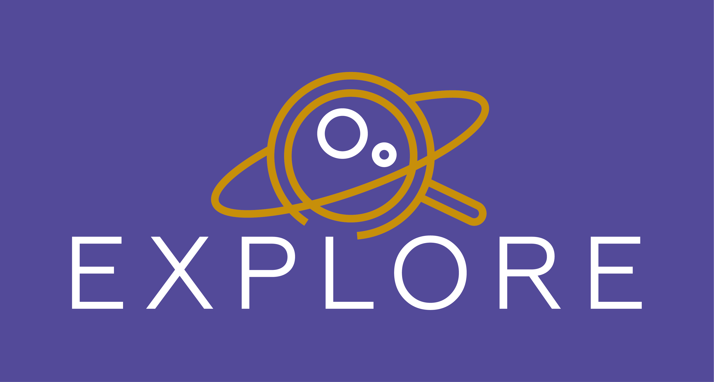

## S-Disco

### Local installation

SDA can be run locally at `http://0.0.0.0:5006/sdisco/sda` (here a path_prefix is defined in the docker-compose.yml):

    git clone https://github.com/explore-platform/s-disco.git
    cd s-disco
    docker-compose up --build

Requires `docker`.

Install data files (see next section) in a local folder and update `docker-compose.yml` to point to this folder.

### Data

Input data files can be retrieved from Zenodo [ZenodoID](https://zenodo.org/).

### User Manual & Tutorial

Please find the user manual and video tutorials on https://explore-platform.eu

### Development roadmap

- [ ] add interaction between the multi-select menu (listing the ID of selected sources) and display of unique RVS spectra as well locating single selected source onto the main panel
- [ ] adapt to new data, if required
- [ ] get all of the RVS spectra (not only those with SNR>20)

## Acknowledgements

This project has received funding from the European Union’s Horizon 2020 research and innovation programme under grant agreement No 101004214. 

 
